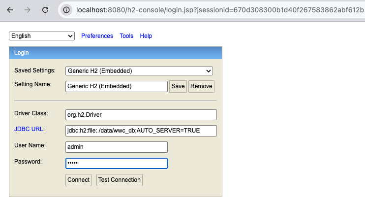

# Getting started

## What do you need?
- Java
- Intellij - hopefully you're already in there :)
- Install Lombok plugin in Intellij and enable annotation processing in settings

## Basic commands
- `./gradlew bootRun` starts spring boot application.
- `./gradlew clean` clears the build directory.
- `./grardlew build` builds the project.
- `--info` at the end of gradle commands shows more detailed logs.
- `ctrl` + `c` in the terminal exits running command.

## Useful Intellij shortcuts
- Press `option` and `F12` at the same time to open the terminal. 
- Double press any of the `shift` buttons to look up a file.
- In `.java` files, hold `command` button on your keyboard and click on a variable name to go to the declaration.

## Logging in to H2 DB console
- Open http://localhost:8080/h2-console in your browser
- Use the following credentials to log in:
  - **JDBC URL**: `jdbc:h2:file:./data/wwc_db;AUTO_SERVER=TRUE`
  - **Username**: `admin`
  - **Password**: `admin`
  - Make sure to select the correct JDBC URL and provide the correct username and password to access the H2 database console.
  - Once logged in, you can execute SQL queries to interact with the database and view the data stored in the tables.
- **You can reset the database by deleting the `data` folder in the project directory. This will remove all existing data and allow you to start with a fresh database when you run the application again.**

  
## DB design

## Tasks

## Tasks
This is a money transfer application. The aim is to be able to create a recipient, check currency exchange rates and create a transfer. 

### 1. Implement Exchange Rate Calculator
Build a currency conversion feature that allows users to calculate how much money they will receive when exchanging between currencies.

**What you need to do:**
- Create a new endpoint in `RateController` (e.g., `GET /rates/convert`) that accepts source currency, target currency, and amount as parameters
- Look up the exchange rate from `RateRepository` using `findBySourceCurrencyAndTargetCurrency()`
- Calculate the converted amount by multiplying the input amount by the rate
- Return the result (original amount, converted amount, rate used, and currencies)
- Handle the case where a currency pair doesn't exist (return an appropriate error message)

**Files to modify:** `RateController.java`

**Test it:** Open `exchange-rate-calculator.html` in the browser and try converting 100 EUR to USD.

### 2. Add Email Field to Recipient
Extend the Recipient entity to store email addresses, allowing users to associate contact information with their recipients.

**What you need to do:**
- Add a new `email` field (type `String`) to the `Recipient` entity class
- Update `schema.sql` to add an `email` column to the recipient table
- Update `data.sql` to include sample email values for existing recipients
- Update `RecipientRepository` to include the email field in the row mapper, INSERT, and UPDATE statements
- Update `recipients.html` to display the email column in the table
- Update `add-recipient.html` to include an email input field in the form

**Files to modify:** `Recipient.java`, `RecipientRepository.java`, `schema.sql`, `data.sql`, `recipients.html`, `add-recipient.html`

**Test it:** Add a new recipient with an email address and verify it appears in the recipients list.

### 3. Implement Transfer Creation with Balance Updates
Complete the money transfer functionality so that when a transfer is created, the sender's balance is deducted appropriately.

**What you need to do:**
- **3.a.** Verify the basic transfer creation works - create a transfer and confirm it appears in the transfers list on the home page
- **3.b.** Deduct the source amount from the appropriate balance when a transfer is created:
  - Look up the balance for the source currency using `BalanceRepository.findByCurrency()`
  - Subtract the transfer's source amount from the balance
  - Save the updated balance
- **3.c.** Add validation to prevent transfers when the balance is insufficient:
  - Before creating the transfer, check if the balance has enough funds
  - If not, return an error response (e.g., HTTP 400 Bad Request with a message)

**Files to modify:** `TransferController.java`

**Test it:**
1. Check your EUR balance on the home page
2. Create a transfer from EUR to USD
3. Verify the EUR balance decreased by the source amount
4. Try to create a transfer larger than your remaining balance - it should fail

### 4. Refactoring exchange rate business logic
``TransferController`` and ``RateController`` currently contain business logic related to exchange rate calculations. 
Refactor the code to move this logic into a separate service class, such as ``ExchangeRateService``.

### 5. Implement drop-down based exchange rate
Use a drop-down menu to select currencies on the exchange rate calculator. The calculator should only show supported currency pairs. 
- 5.a. Implement an endpoint to return the list of all available source currencies. 
- 5.b. Implement an endpoint to return a list of all available target currencies for a certain source currency.
- 5.c. Update ``exchange-rate-calculator.html`` to use ``<select>`` tag with ``<option>`` inside it to list currencies.